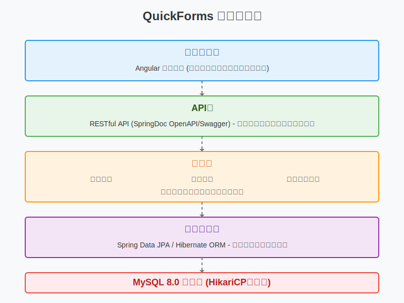

# QuickForms Backend

## 專案介紹

QuickForms Backend 是一個基於 Spring Boot 框架開發的問卷系統後端服務。本服務提供了完整的問卷管理功能，包括問卷的創建、編輯、發布、回收和統計分析等功能。

### 主要功能

1. 問卷管理

   - 問卷模板創建與編輯：支持創建、編輯和保存問卷模板，包含標題、描述等基本信息
   - 問卷結構管理：支持多區塊(Section)設計，每個區塊可包含多種類型問題
   - 問題類型支持：支持多種問題類型，每個問題可設置必填選項和其他屬性
   - 問卷狀態管理：支持草稿(DRAFT)、已發布(PUBLISHED)和已關閉(CLOSED)三種狀態
   - 問卷發布與撤回：提供問卷發布、取消發布和關閉功能
2. 答卷管理

   - 答卷數據收集：提供API接口接收用戶提交的問卷回答
   - 答卷數據存儲：將用戶回答以JSON格式存儲，支持複雜的答卷結構
   - 答卷關聯追踪：記錄每份答卷與原問卷的關聯關係
   - 答卷計數統計：自動統計每份問卷的回答數量
3. 數據分析與統計

   - 實時統計分析：提供問卷回答的實時統計功能
   - 問題回答分布：分析每個問題的回答分布情況
   - 數據可視化支持：提供API接口支持前端數據可視化展示
   - 錯誤處理與日誌：完善的錯誤處理和日誌記錄，確保數據分析的可靠性
4. 系統架構特性

   - RESTful API設計：提供標準化的RESTful API接口
   - 跨域支持：內置CORS配置，支持前後端分離開發
   - 數據驗證：使用Jakarta Bean Validation進行數據驗證
   - 錯誤處理：統一的錯誤處理機制，提供友好的錯誤信息

## 系統架構圖

以下是QuickForms系統的整體架構圖，展示了系統各層之間的關係和數據流向：



### 架構說明

1. **前端應用層**

   - 提供問卷創建、編輯、填寫和統計分析的用戶界面
   - 通過RESTful API與後端服務交互
2. **API層**

   - 提供RESTful風格的API接口
   - 使用SpringDoc OpenAPI/Swagger進行API文檔管理
   - 處理前端請求，並將請求轉發到相應的服務
3. **服務層**

   - 問卷服務：處理問卷的創建、編輯、發布和關閉等操作
   - 答卷服務：處理用戶提交的問卷回答，進行數據驗證和存儲
   - 統計分析服務：對問卷數據進行統計和分析，生成報表
4. **數據訪問層**

   - 使用Spring Data JPA和Hibernate ORM框架
   - 定義實體模型和數據庫操作接口
   - 處理數據的持久化和查詢操作
5. **數據庫層**

   - 使用MySQL 8.0作為數據庫管理系統
   - 採用HikariCP作為高性能連接池
   - 存儲問卷模板、問卷回答和用戶數據

## 技術架構

- **核心框架**: Spring Boot 3.4.2 (含Spring Web MVC、Spring Data JPA)
- **ORM框架**: Hibernate 6.4
- **資料庫**: MySQL 8.0 (配合HikariCP連接池)
- **建置工具**: Gradle 8.5
- **API文檔**: SpringDoc OpenAPI 2.3.0 (集成Swagger UI)
- **驗證框架**: Jakarta Bean Validation 3.0
- **JSON處理**: Jackson Databind 2.17
- **單元測試**: JUnit 5 + Mockito 5
- **Java版本**: JDK 17

## 開發環境需求

- JDK 17 或以上
- MySQL 8.0 或以上
- Gradle 8.x
- IDE 建議：IntelliJ IDEA 或 Eclipse
- Git 版本控制
- Postman 或其他 API 測試工具

### 環境配置步驟

1. **JDK 安裝與配置**

   - 下載並安裝 JDK 17
   - 設置 JAVA_HOME 環境變數
   - 將 Java 執行檔路徑添加到 PATH
2. **MySQL 安裝與配置**

   - 安裝 MySQL 8.0
   - 創建專用數據庫用戶
   - 設置適當的訪問權限

## 快速開始

### 1. 資料庫設置

1. 啟動指令：

```bash
gradlew.bat bootRun  # Windows環境使用
./gradlew bootRun    # Linux/macOS環境使用
```

## API 文檔

1.請參閱：[API文檔](https://github.com/noveres/QuickForms/blob/main/docs/api/API%E6%96%87%E6%AA%94.md)

2.Swagger API文檔： 啟動後端開啟瀏覽器後進入[http://localhost:8585/swagger-ui.html](http://localhost:8585/swagger-ui.html)

## 錯誤處理和故障排除

### 常見問題解決方案

1. **應用啟動失敗**

   - 檢查 MySQL 服務是否正常運行
   - 驗證數據庫連接配置是否正確
   - 確認端口 8585 未被佔用
2. **API 調用失敗**

   - 檢查請求格式和參數
   - 確認跨域設置是否正確
3. **性能問題**

   - 檢查數據庫索引使用情況
   - 監控 JVM 內存使用
   - 優化大量數據查詢

## 專案結構

```


src/
  ├── main/
  │   ├── java/
  │   │   └── com/quickforms/
  │   │       ├── config/         # 配置類
  │   │       ├── controller/     # API 控制器
  │   │       ├── converter/      # 數據轉換器
  │   │       ├── entity/         # 資料模型
  │   │       ├── repositories/   # 資料庫操作
  │   │       ├── services/       # 業務邏輯
  │   └── resources/
  │       └── application.properties  # 應用配置
```
